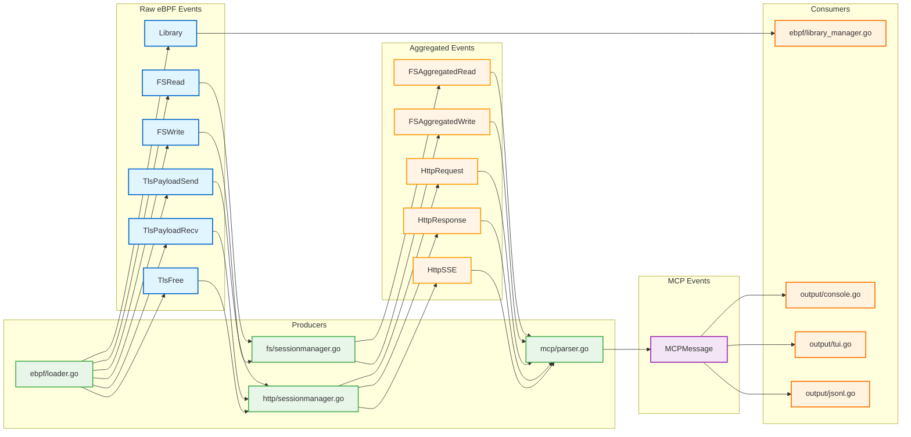

# Event Bus Architecture

MCPSpy uses an event-driven architecture with a publish-subscribe pattern to decouple components and enable flexible data processing pipelines.

## Event Flow



## Implementation Details

MCPSpy uses [`github.com/asaskevich/EventBus`](https://github.com/asaskevich/EventBus) as the underlying event bus implementation.

### Asynchronous Processing with Order Preservation

The event bus is configured with **asynchronous processing** while maintaining **strict ordering per topic**:

```go
b.bus.SubscribeAsync(topic, fn, true)
```

The `true` flag (transactional mode) ensures:

- **Asynchronous execution**: Events are processed in separate goroutines for performance
- **Order preservation**: Events for the same topic are guaranteed to be processed in the order they were published
- **No blocking**: Publishers don't wait for subscribers to complete processing

### Why Order Matters

Order preservation is critical for MCPSpy because:

1. **JSON Aggregation**: Multiple `FSRead` events must be assembled in sequence to form complete JSON messages
2. **HTTP Parsing**: HTTP chunks must be processed in order to reconstruct requests/responses correctly
3. **MCP Protocol**: Request-response matching depends on temporal ordering

Without order preservation, events could be processed out of sequence, leading to corrupted messages or failed parsing.
